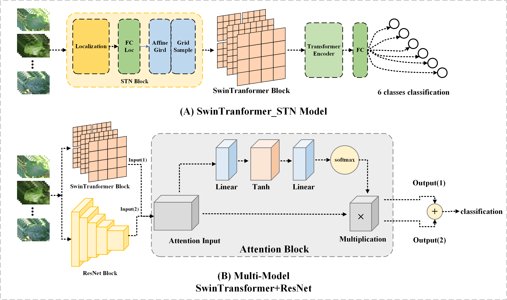
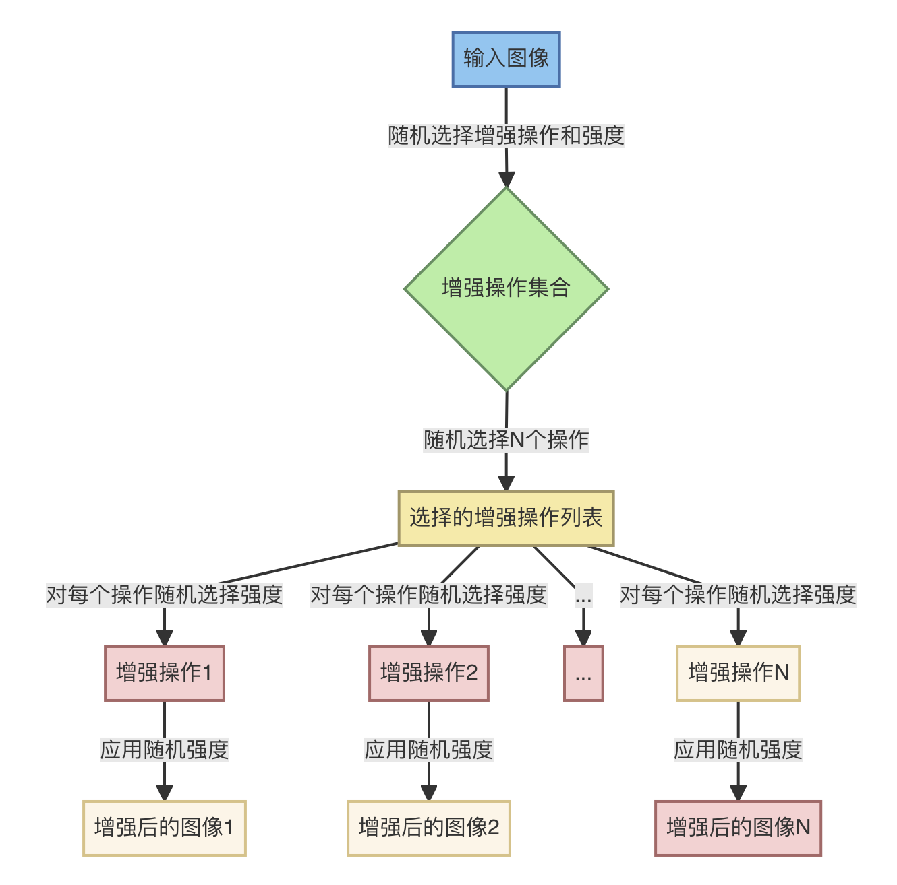
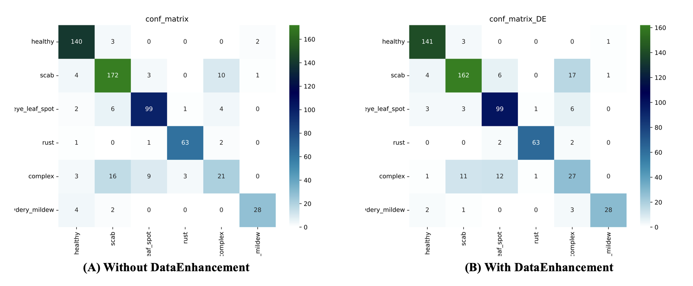
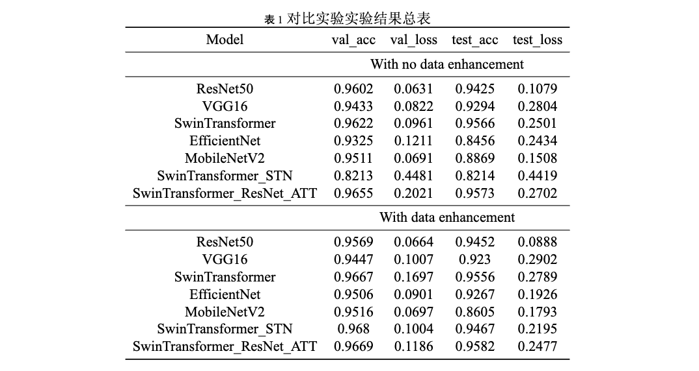

# Plant-Pathology-sysu-2023
classification deep learning project using plant-pathology-2021 dataset

中山大学智能工程学院大三上《计算机视觉》课程小作业，在plant-pathology-2021数据集上的分类任务。


## 摘要

本研究针对植物病理学中的叶片疾病分类任务，采用了多种先进的深度学习模型，包括 **ResNet50、VGG16、 SwinTransformer、EfficientNet 和 MobileNetV2**。在对 SwinTransformer 模型进行结构改进的基础上，引入了 STN 模块，构 建了 SwinTransformer_STN 模型。通过基于 ResNet 的训练结果，**设计了基于多模型的 Attention‐SwinTransformer 模型**， 并在测试集上取得了显著的准确率提升，**达到 96.2%**。此外，为增强数据的多样性，**引入了 RandAugment 数据增强方法**，并在模型训练中进行了广泛应用。实验结果显示，数据增强对各模型性能均产生了积极影响，其中**基于多模型的 Attention‐SwinTransformer 模型的测试准确率达到 96.7%。**这一结果不仅突显了所提出模型的优越性，还强调了数据增强在 提升模型性能方面的重要作用。本研究的亮点在于**对 SwinTransformer 模型结构的创新性改进，以及通过引入 STN 模块和 构建多模型的 Attention 机制**，取得了在植物病理学叶片疾病分类任务中的显著性能提升。同时，通过 RandAugment 数据 增强的应用 ，有效提高了模型对输入数据的适应能力。综合而言，本研究为植物病理学中的图像分类问题提供了一系列有 效的解决方案，为相关领域的研究和应用提供了有益的参考。

## 研究亮点

- 对 ST 模型引入空间变换网络 (STN)，提高叶片疾病图像中空间变换的敏感性
- 引入多模型的概念，采用 ResNet和 ST 结合的方式，添加 attention 模块，提高了模型的性能
- 引入了 RandAugment数据增强方法，提高了模型的鲁棒性和泛化能力。

## 模型结构



## 数据增强

RandAugment 的数据增强原理基于随机选择一组增强操作，以在训练过程中引入多样性。这有助于提高模型的泛化能力，使其在面对不同场景和变化时更具鲁棒性。以下是RandAugment 的主要原理，如图 4 所示随机选择增强操作:在每个训练样本上，RandAugment从一个预定义的增强操作集合中随机选择个增强操作。这个操作集合可以包括各种变换，如旋转、翻转、剪切、缩放等。

随机选择增强操作的强度:对于每个选择的增强操作RandAugment 还会随机选择一个强度参数。这个参数决定了增强的程度或幅度。例如，对于旋转操作，强度参数可以表示旋转的角度。应用增强操作:选定了 N 个增强操作及其对应的强度参 数后，将它们依次应用到输入图像上。这样就得到了一个经 过多次增强的图像。训练模型:使用经过增强的图像进行模型的训练。由于每个训练样本都经历了不同的增强过程，模型被迫适应于更多样化的输入，从而提高了其泛化能力。



## 实验结果

通过分析表 1 的结果，可以得出，SwinTran- former_ResNet_ATT 在 Plant_Pathology 模型上具有最好的 性能，test 数据集准确率达到了 95.73%，高于其他所有实验模型。其中 SwinTranformer_ResNet_ATT 的 test 准确率高于普通 SwinTranformer 模型 0.7%。

另外，通过分析表中信息我们可以得到我的数据增强方 法在部分模型上具有非常好的性能，如在 EfficientNet 上， 我们的模型性能提高了 8.11% 的准确率。在 SwinTrans-former_STN 上提高了 12.53% 的准确率，在SwinTrans-former_ResNet_ATT 模型上提高了 0.09% 的准确率。除此之外，我的数据增强方法，在 Val 数据集上，也有不同程度的提高。

图 7 为 Multi-Model 模型数据增强消融实验热力图结果， 通过热力图结果，我们可以得出结论，添加了数据增强之后， healthy 类的准确率有轻微的提高，frog_eye_leaf_spot 的准确率没有变化，complex 类的准确率有所提高。因此可以表明， 我们的数据增强方法在某些类别上是可行而且有效的。



## 实验结果



## 运行方法

在此部分遇到问题的朋友们可以直接私下联系我。

很容易，直接运行即可。

```bash
python train.py # 运行train和val
python test.py # 运行test
```

在下面这个代码中可以更改每次训练的名字。

```python
# exp
exp_number = 'you_train_name'
```

test的时候注意模型的导入即可。
